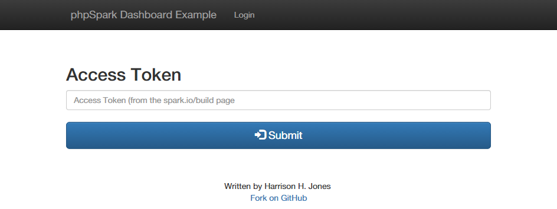
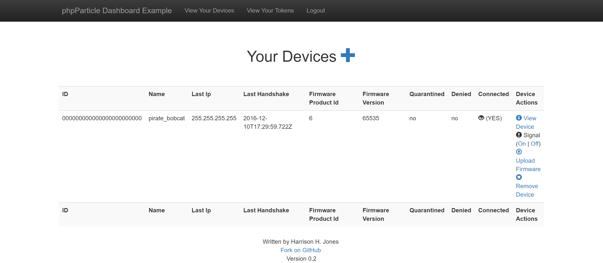
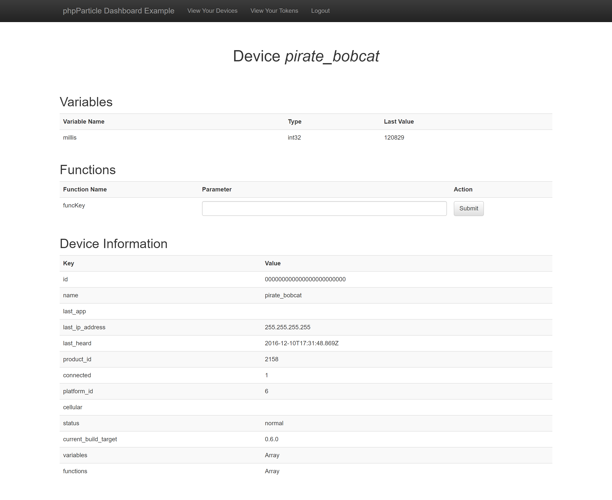
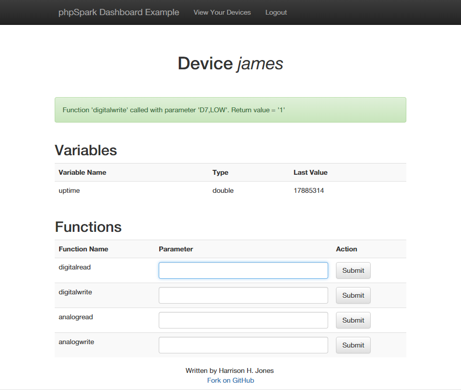

phpSpark Example Dashboard
========

A dashboard example using the phpSpark class

## Installation ##

- GIT clone or download a zip of the repo and unzip into your project directory
- Upload to your web server
- Grab [this copy](https://gist.github.com/harrisonhjones/c9f612457000f3abccb6) of spark.class.php and upload into your project directory
- Visit index.php in a browser.

## Demo ##

Feel free to play around with the [demo](http://projects.harrisonhjones.com/phpSparkDashboard/)

## Preview ##

### Login Page ###
Simply login with your access token (get it from http://spark.io/build)

### Device List Page ###
On the devices page you can see all Spark devices associated with your access token

### Device Info Page ###
On the device info page you can look at a particular device. Available information include known Spark Variables (values update if you refresh the page) and Spark Functions. Send parameters to those functions by filling in the parameter text box and pressing the "Submit" button

### Successful Function Call ###
When you successfully submit a function call to the Spark Cloud you get a alert with the return value.

